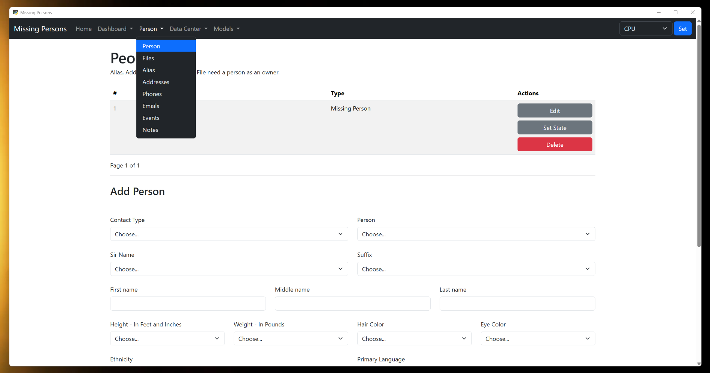
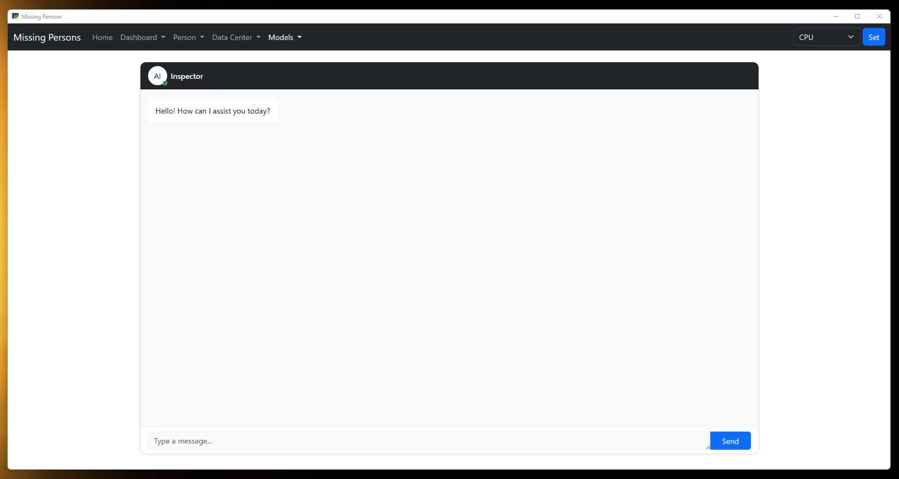
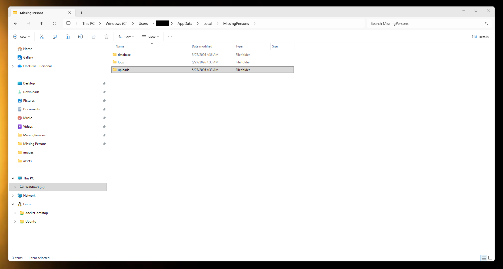
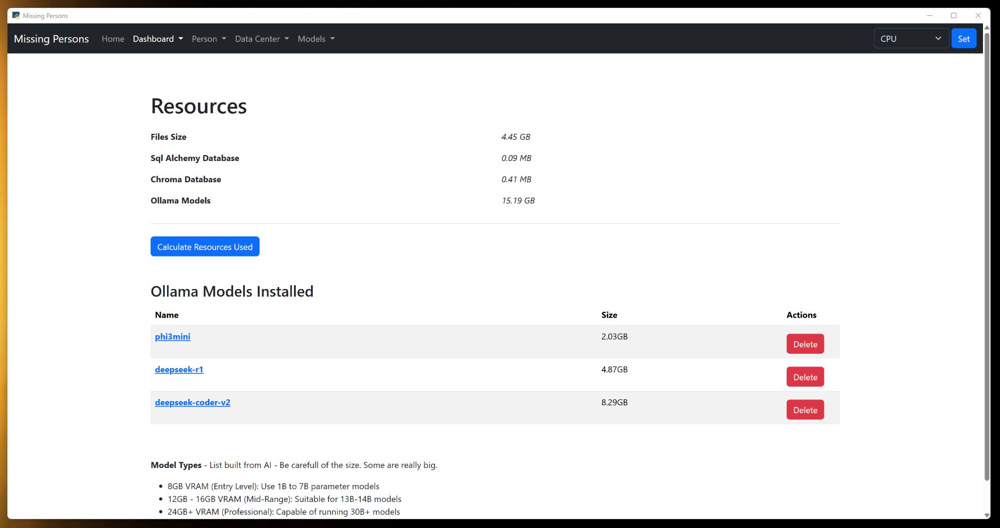
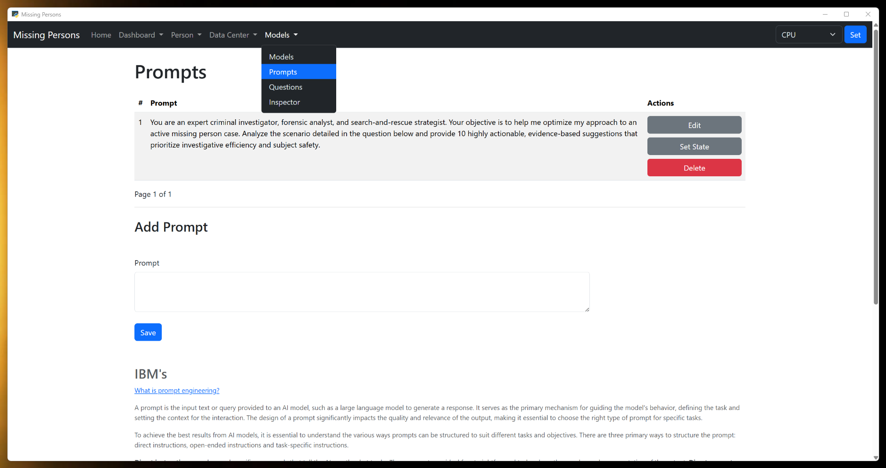
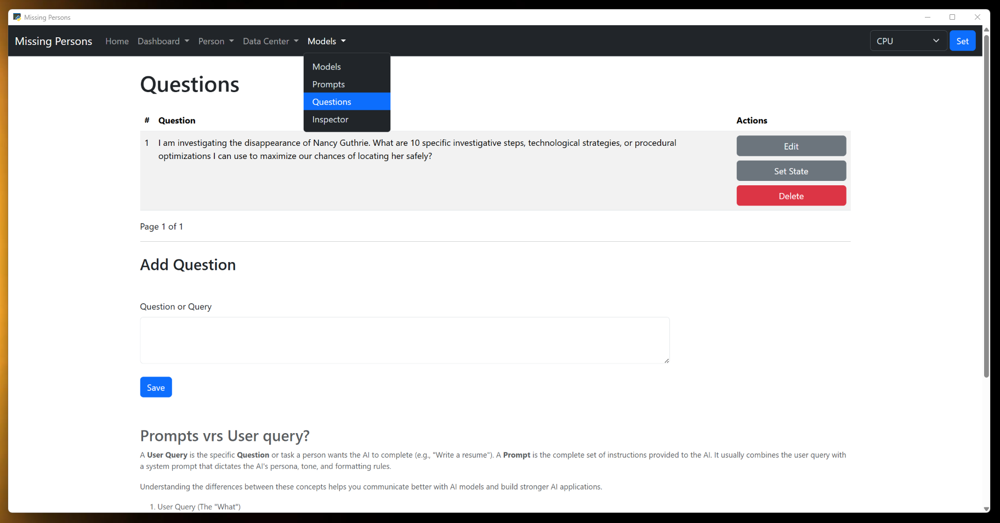

# Missing Persons Agent
Missing Persons is a tool to investigate missing persons. Its built in python and uses pywebview to turn a flask website into a desktop application and then bundle it with pyinstaller into an executable that is installed using Inno. It uses [Ollama](https://ollama.com/download/windows) models. Ollama lets you build and work on an LLM model locally on your computer so you maintain your privacy.

If you are looking to upgrade to a new computer and you want to use missing persons I would recommend to get a computer with at least 16GB of VRAM and a Nvidia GPU proccessor. If you want ultra fast get one with 32 or 64 GB of VRAM. The GPU can range in price based upon size. That being said:

You will need to download Ollama first. They have a great selection of models to use. The different parts of the application rely on the values you set in Application State. Fill them in before running any part of the application.  
Gathered information is saved to Person, Phones, Emails, Addresses, Aliases, Events and Notes first so you can edit it. The data once cleaned up and validated needs to be then saved to the vector database for the LLM to use. There is a file entity to use to upload any image, Pdfs, Excels or Word docs.

## The Build
If you are good with python
- clone the repo
- run 'cd missing-persons-agent'
- optional - create .venv and activate it
- run 'pip install -r requirements.txt'
- run 'python app.py'

### Person and Categories.
- Eack link is a separate entity.
  - Categories - You can have different categories for people, phones, emails and addresses. Define your categories for each and they will show up in each of them when you add or edit rows.
  - Person - A person is anyone you will search for information on through the APIs(next stage). The initial category I created for person was 'Missing Person'. You can change the name of it or create others like 'Person of Interest' etc.. I would keep it in place though because it identifies the person as being missing. Every thing you save into the app is saved with a missing person as an owner. Every person besides the missing person must be owned by a missing person. Missing people will have 0 as an owner.
  - The rest are parts of a person, addresses, emails, phones and alias. They all have an owner which is a person entity.

### Document uploads, API and RSS feeds.
- Api, ApiFields and State.
  - Api - Fill in the information about the api here. Put the full url into the url field including the https:// and the url endpoint.
  - ApiFields - Fill in each field that will be used in the api call. Field is a query parameter and is used to filter results. The field is the query parameter name, value is the value that needs to be there. Everything associated with a person will eventually be an option in the value list. Right now there is only the persons name.
  - State - The appication state.

### Outside installed app data storage.
- Preserves data when updating.
- The vector database is Chroma.
- There is the SqlAchemy database for everything not vectorized.
- When you save data to the SqlAlchemy database, you have to then create a entry from it into the chroma vector database.
  - For Documents the chunks are created and stored under the file name. Only finished pdf for the moment.
  - You can delete the chunks in the edit link of whatever entity you saved it in and the chunks page. There is no editing yet. Will circle back to it soon.

### Ollama for local and future access to Grok, OpenAi and Claude
- Ollama models can be downloaded on the Models page by creating an Ollama model.
- Models can be deleted on the Resources page but be careful you are not using them somewhere else on your computer.
- There is a setting for selecting the type of processor you are using in state.
Look through the available models and choose models that are pretrained in the field you want them trained in.

### Prompts
Build out prompts and questions for LLMs.
- Users can create prompts and questions to use when prompting the LLM on The Prompts and Questions page.

### Questions

### Build Tasks and Data Center
Splitting chunks into different databases or collections in Chroma is highly beneficial when you need to improve query performance, enforce data isolation, or apply distinct metadata filters across different sets of documents.

[Thinking in LangGraph](https://docs.langchain.com/oss/python/langgraph/thinking-in-langgraph)

When you build an agent with LangGraph, you will first break it apart into discrete steps called nodes. Then, you will describe the different decisions and transitions from each of your nodes. Finally, you connect nodes together through a shared state that each node can read from and write to.

- Build an agent that operates continuously with stop options
- Create a nodes table that the user can define the nodes.
  - Create tools that can be used by the agent.
  - List MCP servers that the agent can connect to.
  - Load the Chroma database with person, emails, phones, addresses and aliases.
  - Load the Chroma database with Events and notes.
  - Load the Chroma database with Documents including txt files pdfs excel and word docs.
  - Connect to APIs and Rss Feeds to pull data in as json.
  - Find new people of interest and accessing data points for them.
  - Parse the returned json and save new data to the database related to the case.
  - Prompting the model for connections that could lead to finding the person.
  - When new data is found the data is added to the entity as a [OSINT](https://github.com/cipher387/API-s-for-OSINT) row.

  - The database have 3 separate collections.
    - database - stores data for the RAG LLM to determine the table and column to save data pulled from the API and Rss Feed json.
    - investigation - stores data from the person, email, phone, alias, address, event and note table data for investigating.
    - investigator - stores data from pdfs and documentation on how to investigate. You can create a pdf here with your own private methods.

### Add in Autosearch
Andrej Karpathy revolutionized prompt and AI optimization by introducing the "Autoresearch" pattern (often dubbed "The Karpathy Loop"). Instead of humans manually tweaking prompts, an AI agent optimizes them by iteratively modifying a prompt, running a test against a strict evaluation rubric, keeping changes if the score improves, and discarding failures.
- Add auto search to the agent to aid in optimizing prompts if possible.

### Events to construct a Timeline
- Use the data gathered from the APIs to build timelines for each person.

### Images and Videos
- Add images and video to the person object to use when looking though images and videos for matching.
- Build ability to train a model on video and images.
- Build out functionality for testing and viewing data from videos and images.

### Linkedin / Facebook Style Messaging
- A messaging system like Linkedins where people who are searching for someone can share notes.

### Central Data Store
- A central data storage where all data on an investigation can be accessed by any one using Missing Persons.

## Section Details

- Categories - Work and in testing.
  - Categories - You can have different categories for people, phones, emails, addresses and events. Define your categories for each and they will show up in each of the entities as Type when you add or edit rows. I created two categories for person. They are 'Missing Person' and 'Person of Interest'. You can change them or create others but you will be unable to delete them because they are going to be used by the system.
- Person - Work in SqlAlchemy, working on the save and update functions for Chroma Db now.
  - Person - A person is the Missing Person or anyone that came in contact with them; Person of Interest. Each Person will either be at the top of a Tree type of structure;  think department where the boss is at the top, departments under the Boss and workers under a department. The 'Missing Person' is the Boss the rest of their contacts will have a parent child relationship with another Person in the Tree.  The Person only describes the individual. If you have more data than form elements use the description field.  All Persons have one or more Emails, Addresses, Aliases, Phones, Events and Notes that you can create for them. First create a person. Then go to and add Emails, Addresses, Aliases, Phones, Events and Notes and fill in the data you have on the person. Once your done adding data go back to the edit page of the person you added the data for and save the person again. The data will be consolidated into a single chunk of text and saved in the Chroma vector database.  Make sure to choose the person you want to add the data to when filling in Emails, Addresses, Aliases, Phones, Events and Note.  
  - Addresses - Addresses is any address used by the person. Create a Type for it in Categories first. Example Category: Home, Work, etc..
  - Emails - Emails are any emails used by the person. Create a Type for it in Categories first. Example Category: Personal, Work, etc..
  - Phones - Phones are any phone number used by the person. Create a Type for it in Categories first. Example Category: Cell, Work, etc..
  - Aliases - Alias are any aliases used by the person.
  - Events - Events are any event that happens related to the person. Create a Type for it in Categories first. Example Category: Alibi, Court Date, etc..
  - Notes - Notes are any other data related to the person.

- Files - Added as data for the LLM.
  - Pdf - Save works but needs update.
  - Excel - Coming soon..
  - Csv - Coming soon..
  - Word - Coming soon..
  - Image - Works, will continue to test.
  - mp3 - Audio files - Coming soon..
  - mp4 - Movie files - Coming soon..

- Data APIs - Working on the save functions now.
  - RSS Feeds - Use RSS Feeds to gather data. You can select data by json nodes. Then turn the results into chunks by clicking the save button provided on each row. This will open a Modal that allows you to save the value of that node to any field you want in the SqlAlchemy database. From there you will need to save the edited version in edit person.
  - Data APIs - Use APIs to gather data. You can select data by json nodes. Then turn the results into chunks by clicking the save button provided on each row. This will open a Modal that allows you to save the value of that node to any field you want in the SqlAlchemy database. From there you will need to save the edited version in edit person.

- Model APIs - Only Ollama works.
  - Ollama - This is the initial Model I used because it all runs on local and is testable without paid subscription. Can be a bit slow.. You can speed this up by selecting GPU in the form on the upper right corner.
  - OpenAI - If you don't have GPUs then I plan to give you the ability to connect with OpenAI so you can run data on their models with their GPUs if you like.
  - Grok - Same with Grok.
  - Claude - Same with Claude.</li>

## ideas

05/27/2026 - It needs to have a central store of all data pertaining to an investigation. A vector database where anyone using Missing Persons or other software like Missing Persons can plug into and use the data stored there in their investigation. The information should be submitted to be added in the style of git. Then merged into the main branch when validated. The nice thing about this is the data can be valid, deduplicated and always ready.

06/14/2026 -  Had new idea to build a Nodes table so a user can define a list of tasks for the model to work on.

It uses Langchain Chroma for storing data for the LLM. It is open-source with no usage limits on local machines.

It also uses sqlite with Sql Alchemy ORM for storing data so you can adjust the data before saving it to the vector database. I am will probably also create a sub model for deciding what to choose when dealing with duplicate data.

My hopes is that 1000s of people will work together using this tool to search through the tons of video footage for the missing person in the first couple days of their disappearance and find them because with everyone using it we were able to do something faster.

I would love to convince the people behind the cameras to have the data saved on a servers backed up for at least a month with a front facing domain and website that can support a read only API to view the videos so this program can run images against them.

Ill create a list of the Camera and Missing persons APIs that people can use here when I find them.

I would think that using the RSS method described in the youtube video [Turn Facebook Pages or Groups Into RSS Feeds](https://www.youtube.com/watch?v=Nt2pc1IIESI&t=4s) and collecting as much data as you can from every social media platform you can apply this to, you could build a sort of profile for each individual in the social group of the missing individual. Then train the agent with it and have it create a probability distribution on who it thinks fits the bill.

Continue to collect and agregate the data daily to look for more clues.

Was thinking this morning about having the program continue out wards in the tree from ground zero and automatically as it finds new acquaintances get an RSS feed for them and pull in their data. Your computer would always be searching and indexing new people in hope of finding a connection. I could set up a parameter for levels out. Also was thinking about a fine tunner agent that gives suggestions for fine tuning the LLM and your work on finding the person using this tool. The interesting concept is an agent that improves itself.

It would be a good idea I would think to add as many missing people as you can find and the immediate people groups they will have so you can look for people that are in every group. In case the person is involved in a ring of abductions where the same person is doing recruiting or abducting. Search for deleted or blocked accounts in the missing persons list of contacts or accounts that where deleted by the owners who were once friends with the missing person.

### Links

[Invisible Threads](https://blog.ry4n.org/invisible-threads-finding-missing-people-online-7dec4cb038e5).

[Best Practices for Text-to-SQL Use Cases with LLMs](https://www.linkedin.com/pulse/best-practices-text-to-sql-use-cases-llms-dave-thibault-mr9ac/)
