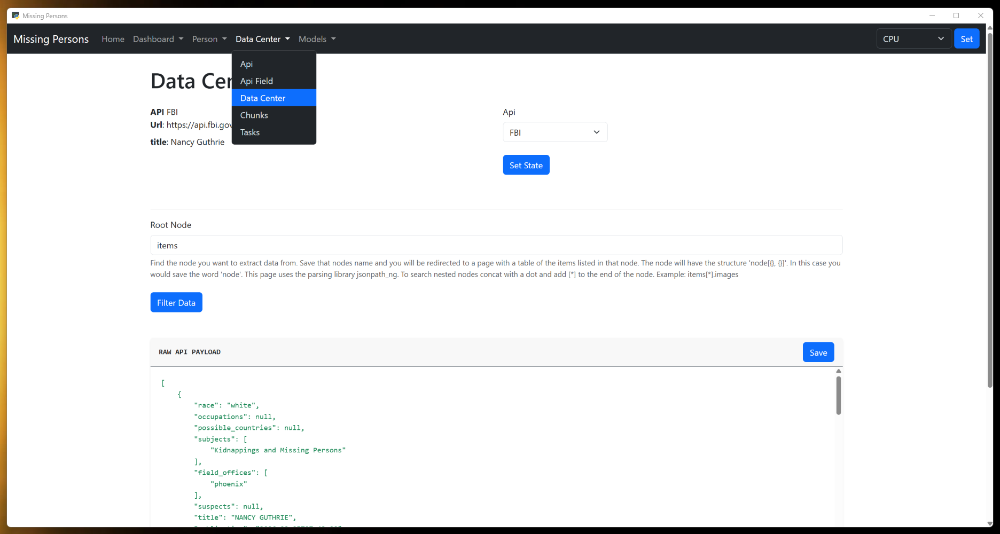
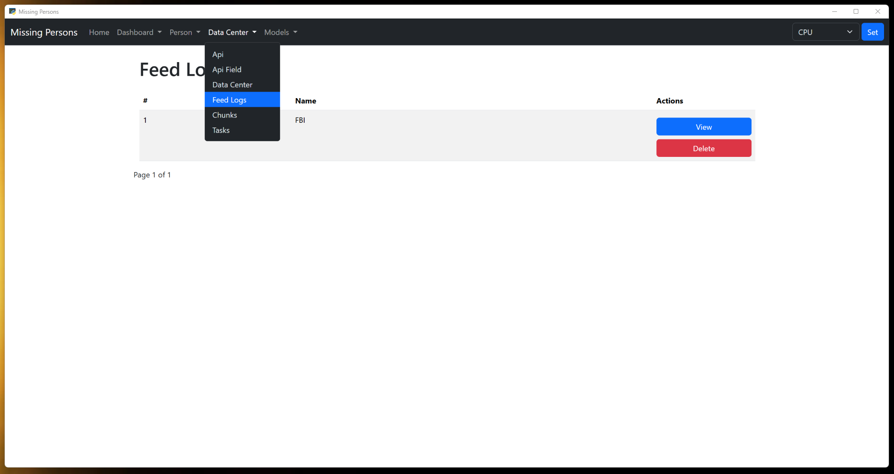
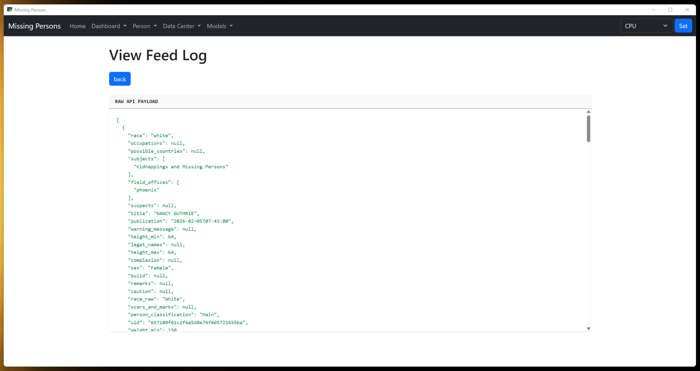
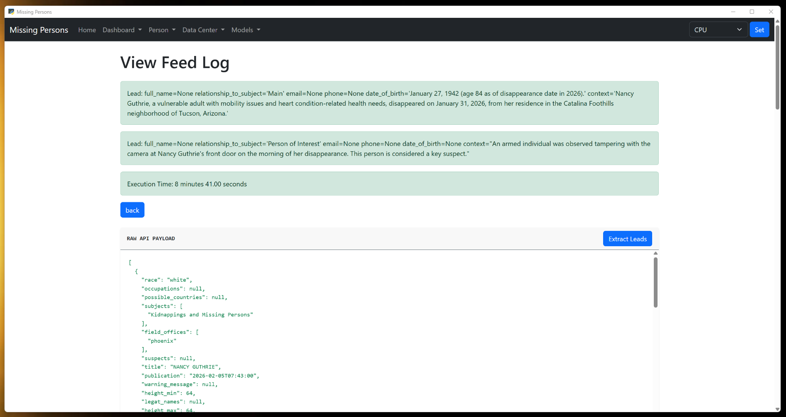
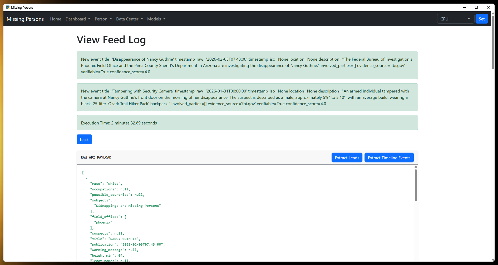
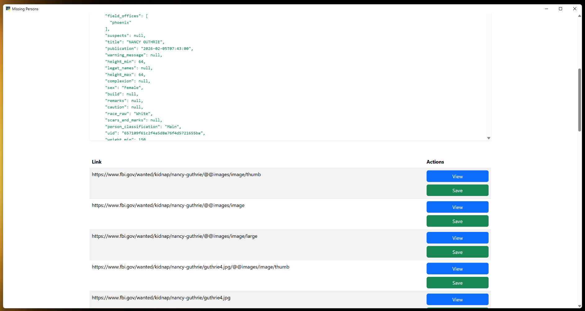
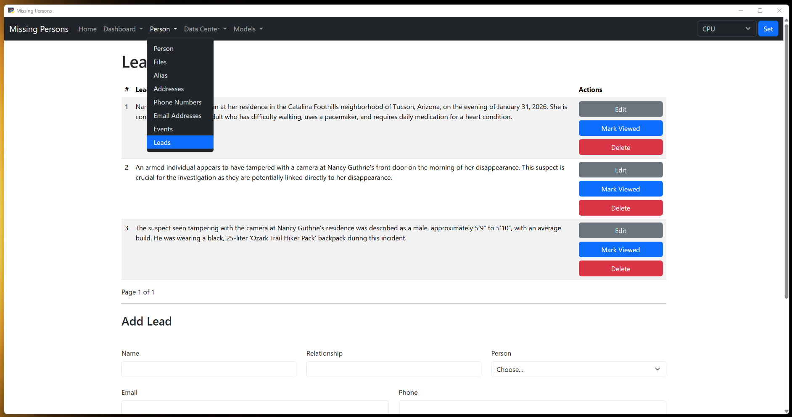
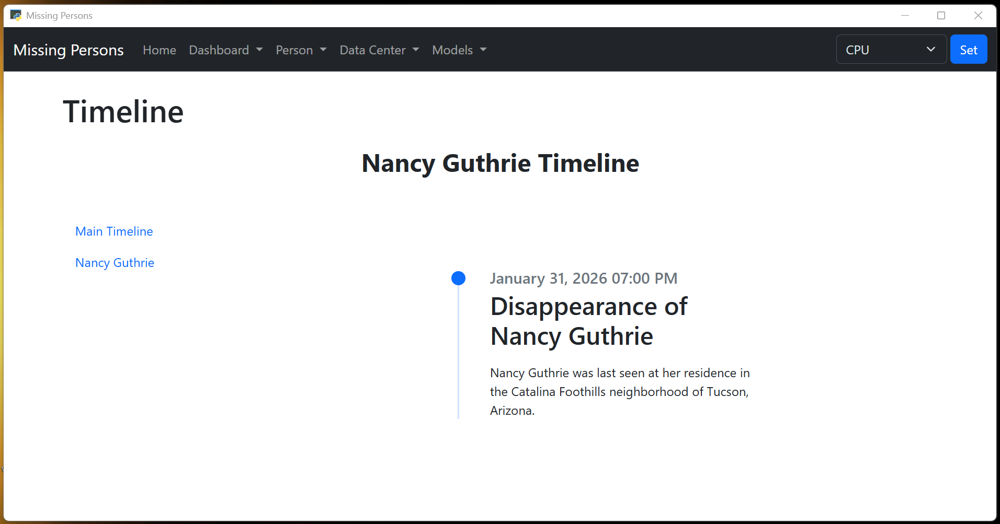

# Missing Persons Agent
― Roy T. Bennett, The Light in the Heart

Difficulties and adversities viciously force all their might on us and cause us to fall apart, but they are necessary elements of individual growth and reveal our true potential. We have to endure and overcome them and move forward. Never lose hope. Storms make people stronger and never last forever.

## phi4
This is the best model I found to use for my laptop that has 8 + 16 GB RAM, 1 Terabyte of ROM and running on a CPU.

Missing Persons is a tool to investigate missing persons. Its built in python and uses pywebview to turn a flask website into a desktop application and then bundle it with pyinstaller into an executable that is installed using Inno. It uses [Ollama](https://ollama.com/download/windows) models. Ollama lets you build and work on an LLM model locally on your computer so you maintain your privacy.

If you are looking to upgrade to a new computer and you want to use missing persons I would recommend to get a computer with at least 16GB of VRAM and a Nvidia GPU proccessor. If you want ultra fast get one with 32 or 64 GB of VRAM. The GPU can range in price based upon size. That being said:

You will need to download Ollama first. They have a great selection of models to use. The different parts of the application rely on the values you set in Application State. Fill them in before running any part of the application.  
Gathered information is saved to Person, Phones, Emails, Addresses, Aliases, Events and Reports first so you can edit it. The data once cleaned up and validated needs to be then saved to the vector database for the LLM to use. There is a file entity to use to upload any image, Pdfs, Excels or Word docs.

You can change models so when you get a better computer with VRAM and NVIDIA GPU you can run larger models.
You can change the system_prompts(prompts) if you are a prompt engineer and know how to fine tune them. There is a default that no matter what you can always revert to.
You can change user_querys(questions) if you are a prompt engineer and know how to fine tune them. There is a default that no matter what you can always revert to.

You can investigate simular missing persons cases and look for people who they all came in contact with but where new to their lives.

## The Build
If you are good with python
- clone the repo
- run 'cd missing-persons-agent'
- optional - create .venv and activate it
- run 'pip install -r requirements.txt'
- run 'python app.py'

### Person and Categories.
- Eack link is a separate entity.
  - Categories - You can have different categories for people, phones, emails and addresses. Define your categories for each and they will show up in each of them when you add or edit rows.
  - Person - A person is anyone you will search for information on through the APIs(next stage). The initial category I created for person was 'Missing Person'. You can change the name of it or create others like 'Person of Interest' etc.. I would keep it in place though because it identifies the person as being missing. Every thing you save into the app is saved with a missing person as an owner. Every person besides the missing person must be owned by a missing person. Missing people will have 0 as an owner.
  - The rest are parts of a person, addresses, emails, phones and alias. They all have an owner which is a person entity.

### Document uploads, API and RSS feeds.
- Api, ApiFields and State.
  - Api - Fill in the information about the api here. Put the full url into the url field including the https:// and the url endpoint.
  - ApiFields - Fill in each field that will be used in the api call. Field is a query parameter and is used to filter results. The field is the query parameter name, value is the value that needs to be there. Everything associated with a person will eventually be an option in the value list. Right now there is only the persons name.
  - State - The appication state.

### Outside installed app data storage.
- Preserves data when updating.
- The vector database is Chroma.
- There is the SqlAchemy database for everything not vectorized.
- When you save data to the SqlAlchemy database, you have to then create a entry from it into the chroma vector database.
  - For Documents the chunks are created and stored under the file name. Only finished pdf for the moment.
  - You can delete the chunks in the edit link of whatever entity you saved it in and the chunks page. There is no editing yet. Will circle back to it soon.

### Ollama for local and future access to Grok, OpenAi and Claude
- Ollama models can be downloaded on the Models page by creating an Ollama model.
- Models can be deleted on the Resources page but be careful you are not using them somewhere else on your computer.
- There is a setting for selecting the type of processor you are using in state.
Look through the available models and choose models that are pretrained in the field you want them trained in.

### Prompts
Build out prompts and questions for LLMs.
- Users can create prompts and questions to use when prompting the LLM on The Prompts and Questions page.

### Questions

### Data Center
Build out Data Center
- Run Apis, RSS Feeds or Page Scrapes
- Filter the data if the feed relies on loose keyword matching.
- When the user is happy they can save the JSON data to the Feed Logs database.
- View feed log page
  - Extract Leads - Uses an agent to find and list leads in the json data.
  - Extract Timeline Events - Uses an agent to find and list events in the json data that can be used to build a timeline of a person.
    - When extracted its listed the event even if it does not have a reliable date or time so the user can fill those in.
    - Field for timeline so the events can be added to specific timelines
    - Add a field for text date time so it can be recorded as a text strin (eg. 'evening', 'afternoon')
    - Im giving 7 am to morning 3pm for afternoon and 7pm for evening as times for these text representations. I'll make it apparent that the time is a guess on the timeline. You will be able to adjust the time in edit event.
  - Pull out and list all document or image Links with FQDN(fully qualified domain name)
    - view link
    - save link to files

### Timeline for each Person
A UI that displays recorded events for each person who has a role in the investigation ordered in a timeline.
- Main Timeline - Has all events.
- Named timelines - Has only events for the person named in the link.

### Agent Instructions
Build a database called instructions to let the user save specific investigation instructions it want the agent to get.
- Has Drag N Drop list of instruction
- Saves add rows to a .md file under Files so it can be chunked.
- Add a Mark Down Editor like easyMDE. Keep getting duplicate editors. Maybe a conflict with sortable.

### Agent
- Build an agent that loads all the data saved to the vecotor database and tries to answer the question.
  - Where is the missing person?
  - Who did it?
- Documents for Training the Agent - Build an initialize function to load and chunk documents from agent_instructions into the file system and then chunked into the vector database.
  - investigation.md
  - CPD-11.351.pdf
  - Guidelines to Digital Forensics First Responders_V7.pdf
  - Missing Person Data Collection.pdf
Agents Settings
- Set agent to use only the data saved in the vector database
- Set agent to only use the Feeds logged.
- Set agent to use all data

Agents analyzing data in a missing persons investigation should focus on triangulating time, location, and behavioral patterns to establish a timeline and assess risk. Data analysis must shift from merely gathering personal descriptions to detecting anomalies in the subject's routine, communications, and digital footprint.
- What was the last verifiable action the subject took, and did it deviate from their baseline routine?
  - Compare the last known cell phone ping with their typical commuting route or GPS history.
  - Example: If the subject always takes the bus to work, why did location data show them walking into a heavily wooded park at 2:00 AM?
- What does the digital communication traffic reveal immediately before the disappearance?
  - Review the last messages sent. Look for uncharacteristic language, distress, or abrupt changes in communication habits.
  - Cross-reference web search history with recent purchases.
  - Example: Search history shows inquiries about "buying bus tickets to [City]" on the same day bank data shows a withdrawal of funds.
- Where and how has the subject's money been accessed since they went missing?
  - Monitor for sudden depletion of bank accounts or the cessation of routine auto-pay bills.
  - Track point-of-sale transactions.
  - Example: A subject with a fixed-income status suddenly makes an unusual, high-dollar purchase at an outdoor supply store.
- Are there underlying physical, emotional, or environmental conditions contributing to the disappearance?
  - Check medical data for changes in prescriptions, recent surgeries, or cognitive impairment (e.g., Alzheimer's/Dementia).
  - Example: If the subject requires daily, life-saving medication, analyzing pharmacy records can confirm whether they left with an adequate supply.
- Who are the subject's closest, most frequent, or most recently contacted associates?
  - Use call detail records (CDRs) to establish network graphs. Look for individuals whose numbers suddenly stop appearing, or contact numbers that surged right before the disappearance.
  - Example: Phone logs indicate daily calls with an unknown number that belongs to someone with a history of crossing state lines.

Edge Cases: A list of examples that can be added to the prompt to instruct the agent on what to look for.
- Someone has the same set of clothing as an unidentified man/women at the crime scene.
  - Search for people who have things that are identified to be at the crime scene.
- A persons friend are less likely to hide important information that a missing person might try to hide.
  - Search for close friends of missing person as a direct source of information on the missing persons day to day movements.
- Images hold metadata that you cannot see when you look at it.
  - Where it might have been taken.
  - What camera or camera type took it.

For every answer you give, explain how you came to the conclusion.

[OSINT for Missing People Investigations](https://www.youtube.com/watch?v=BpN09NhAUIU&t=239s)

[Data Collection](https://www.criminaljustice.ny.gov/missing/findthem/docs/Missing%20Person%20Data%20Collection.pdf)

[Missing Persons Checklist](https://directives.chicagopolice.org/forms/CPD-11.351.pdf)

### Add in Audio to text
Use a package that can listen to audio and video and convert the talking to text to be searched for clues, leads and connections.
- @TODO need to get llama-liquid-audio-cli set up.

### Add item to Contextual Menu
- Create add Person button to save select text to create
  - Person
  - Email Address
  - Phone Number
  - Alias
  - Address
  - Lead
  - Timeline Event

### Add in Autosearch
Andrej Karpathy revolutionized prompt and AI optimization by introducing the "Autoresearch" pattern (often dubbed "The Karpathy Loop"). Instead of humans manually tweaking prompts, an AI agent optimizes them by iteratively modifying a prompt, running a test against a strict evaluation rubric, keeping changes if the score improves, and discarding failures.
- Add auto search to the agent to aid in optimizing prompts if possible.

### Images and Videos
- Add images and video to the person object to use when looking though images and videos for matching.
- Build ability to train a model on video and images.
- Build out functionality for testing and viewing data from videos and images.

### Linkedin / Facebook Style Messaging
- A messaging system like Linkedins where people who are searching for someone can share notes.

### Central Data Store
- A central data storage where all data on an investigation can be accessed by any one using Missing Persons.

## Collections
- database - Stores data for the RAG LLM to determine the table and column to save data pulled from the API and Rss Feed json.
- investigation - Stores data from the person, email, phone, alias, address, event and note table data for investigating.
- investigator - Stores data from pdfs and documentation on how to investigate. You can create a pdf here with your own private methods.
- vehicles_of_interest - Stores vehicle descriptions.
- witness_statements - Stores witness statements.

## Section Details
- Categories - Work and in testing.
  - Categories - You can have different categories for people, phones, emails, addresses and events. Define your categories for each and they will show up in each of the entities as Type when you add or edit rows. I created two categories for person. They are 'Missing Person' and 'Person of Interest'. You can change them or create others but you will be unable to delete them because they are going to be used by the system.
- Person - Work in SqlAlchemy, working on the save and update functions for Chroma Db now.
  - Person - A person is the Missing Person or anyone that came in contact with them; Person of Interest. Each Person will either be at the top of a Tree type of structure;  think department where the boss is at the top, departments under the Boss and workers under a department. The 'Missing Person' is the Boss the rest of their contacts will have a parent child relationship with another Person in the Tree.  The Person only describes the individual. If you have more data than form elements use the description field.  All Persons have one or more Emails, Addresses, Aliases, Phones, Events and Reports that you can create for them. First create a person. Then go to and add Emails, Addresses, Aliases, Phones, Events and Reports and fill in the data you have on the person. Once your done adding data go back to the edit page of the person you added the data for and save the person again. The data will be consolidated into a single chunk of text and saved in the Chroma vector database.  Make sure to choose the person you want to add the data to when filling in Emails, Addresses, Aliases, Phones, Events and Report.  
  - Addresses - Addresses is any address used by the person. Create a Type for it in Categories first. Example Category: Home, Work, etc..
  - Emails - Emails are any emails used by the person. Create a Type for it in Categories first. Example Category: Personal, Work, etc..
  - Phones - Phones are any phone number used by the person. Create a Type for it in Categories first. Example Category: Cell, Work, etc..
  - Aliases - Alias are any aliases used by the person.
  - Events - Events are any event that happens related to the person. Create a Type for it in Categories first. Example Category: Alibi, Court Date, etc..
  - Reports - Reports are any other data related to the person.

- Files - Added as data for the LLM.
  - Pdf - Save works but needs update.
  - Excel - Coming soon..
  - Csv - Coming soon..
  - Word - Coming soon..
  - Image - Works, will continue to test.
  - mp3 - Audio files - Coming soon..
  - mp4 - Movie files - Coming soon..

- Data APIs - Working on the save functions now.
  - RSS Feeds - Use RSS Feeds to gather data. You can select data by json nodes. Then turn the results into chunks by clicking the save button provided on each row. This will open a Modal that allows you to save the value of that node to any field you want in the SqlAlchemy database. From there you will need to save the edited version in edit person.
  - Data APIs - Use APIs to gather data. You can select data by json nodes. Then turn the results into chunks by clicking the save button provided on each row. This will open a Modal that allows you to save the value of that node to any field you want in the SqlAlchemy database. From there you will need to save the edited version in edit person.

- Model APIs - Only Ollama works.
  - Ollama - This is the initial Model I used because it all runs on local and is testable without paid subscription. Can be a bit slow.. You can speed this up by selecting GPU in the form on the upper right corner.
  - OpenAI - If you don't have GPUs then I plan to give you the ability to connect with OpenAI so you can run data on their models with their GPUs if you like.
  - Grok - Same with Grok.
  - Claude - Same with Claude.</li>

## ideas

05/27/2026 - It needs to have a central store of all data pertaining to an investigation. A vector database where anyone using Missing Persons or other software like Missing Persons can plug into and use the data stored there in their investigation. The information should be submitted to be added in the style of git. Then merged into the main branch when validated. The nice thing about this is the data can be valid, deduplicated and always ready.

06/14/2026 -  Had new idea to build a Nodes table so a user can define a list of tasks for the model to work on.

It uses Langchain Chroma for storing data for the LLM. It is open-source with no usage limits on local machines.

It also uses sqlite with Sql Alchemy ORM for storing data so you can adjust the data before saving it to the vector database. I am will probably also create a sub model for deciding what to choose when dealing with duplicate data.

My hopes is that 1000s of people will work together using this tool to search through the tons of video footage for the missing person in the first couple days of their disappearance and find them because with everyone using it we were able to do something faster.

I would love to convince the people behind the cameras to have the data saved on a servers backed up for at least a month with a front facing domain and website that can support a read only API to view the videos so this program can run images against them.

Ill create a list of the Camera and Missing persons APIs that people can use here when I find them.

I would think that using the RSS method described in the youtube video [Turn Facebook Pages or Groups Into RSS Feeds](https://www.youtube.com/watch?v=Nt2pc1IIESI&t=4s) and collecting as much data as you can from every social media platform you can apply this to, you could build a sort of profile for each individual in the social group of the missing individual. Then train the agent with it and have it create a probability distribution on who it thinks fits the bill.

Continue to collect and agregate the data daily to look for more clues.

Was thinking this morning about having the program continue out wards in the tree from ground zero and automatically as it finds new acquaintances get an RSS feed for them and pull in their data. Your computer would always be searching and indexing new people in hope of finding a connection. I could set up a parameter for levels out. Also was thinking about a fine tunner agent that gives suggestions for fine tuning the LLM and your work on finding the person using this tool. The interesting concept is an agent that improves itself.

It would be a good idea I would think to add as many missing people as you can find and the immediate people groups they will have so you can look for people that are in every group. In case the person is involved in a ring of abductions where the same person is doing recruiting or abducting. Search for deleted or blocked accounts in the missing persons list of contacts or accounts that where deleted by the owners who were once friends with the missing person.

I decided on building tools and skills that use MCP when possible to get lists of articles and posts from social media to construct timelines, people who have had contact with the missing person to construct persons of interest and accessing public databases for any other information that could be helpful in the investigation. This seems to be the most robust and scalable way to move forward.

I'm also only going to focus on text, capturing audio as text and running the agents to search for clues and connections for now because it seems that images and videos in the scope of gas station cameras will not be so accessible.

What would work wonderfully is a server with pedabytes of storage. A person researching and finding/building API endpoints, RSS Feeds, and scraping web pages. A person working tasks and adding the data found by: The main computer that doing the constant searching by APIs, Rss Feeds and saved data that constantly runs and creates new tasks, the LLM agents. Another person is tweaking and prompting another set of LLMS that are searching the data for clues, leads and connections. Each one of the team is hooked into the server which is the storage unit for all the collected data. Each one of the team has a computer that halls a** with at least a Terabyte of storge and 64 to 132 GB of RAM. The Computer running the Agents needs to have VRAM ad Nvidia GPUs the bigger the better. You can add more people too to have it go faster.

Each API is unique in ways.
The official FBI Wanted API does not provide a dedicated exact match parameter for keyword queries. It relies on loose keyword matching. If you search for 'John Smith', it will return all references to John and Smith and not the exact match of 'John Smith'.

I asked AI: If I have an API like the official FBI Wanted API that does not provide a dedicated exact match parameter for keyword queries. I need data that I can pass to a agent for processing about an investigation. Should I clean the data before passing it to the agent or have the agent pick relevant data from the respose?

It answered: You should clean and filter the data before passing it to the AI agent rather than relying on the agent to pick relevant data from a raw API response. Because the FBI Wanted API relies on loose keyword matching, a query for a specific name can return a massive JSON payload filled with unrelated fugitives, partial matches, or long-closed cases. Passing this raw noise directly to an agent introduces major operational risks and inefficiencies.

In the new age of agents APIs will need to offer exact data options to aid in AI development. It would be awesome if all APIs could offer a parameter that sets all matching to exact match. exact_match=True

### Links

[Invisible Threads](https://blog.ry4n.org/invisible-threads-finding-missing-people-online-7dec4cb038e5).

[Best Practices for Text-to-SQL Use Cases with LLMs](https://www.linkedin.com/pulse/best-practices-text-to-sql-use-cases-llms-dave-thibault-mr9ac/)

[Gen AI Agent Resource](https://github.com/NirDiamant/GenAI_Agents)

[IBMTechnology](https://www.youtube.com/@IBMTechnology/playlists)

[CLI vrs MCP Servers](https://www.youtube.com/watch?v=g9JIUM0MHgQ)

[The Best LOCAL Agentic Coding Workflow](https://www.youtube.com/watch?v=hfba9dAT6xE)

- System Prompt
- AGENT.md
  - It is loaded into the conversation history very frequently (often at the start of every session or turn). This could be using alot of tokens.
  - Keep it short (ideally under 200 lines). The immutable rules of the agent.
- Saving static data from pdfs or relational databases in chunks to vector database so it can be used by a RAG LLM.
- CLI Commands
  - Cli commands are built into its training data.
  - Good when commands map directly to jobs.
  - Can be chained together on one line.
- MCP servers
  - The LLM (The Brain): It evaluates when it needs external help or data. It does not need to be hard-coded with tool APIs.
  - The MCP Host/Client (The Broker): This is the application you are running (e.g., Cursor, Claude Desktop, or an agent framework like LangChain). It brokers the connection between the LLM and the external world.
  - The MCP Servers (The Hands): These are distinct, external services (e.g., GitHub, Google Drive, Postgres, Slack, or local file systems). You plug these servers into your MCP Host so your LLM can interact with them.
    - Resources like files.
    - Tools @mcp.tool()
    - Prompts - In the Model Context Protocol (MCP), servers act as pre-defined prompt templates that expose reusable workflows and instructions to your AI client. Instead of forcing users to repeatedly type complex instructions, the MCP server packages these guidelines into ready-to-use menu options, often appearing in your AI interface as slash commands or clickable UI templates.
    - [MCP Registry](https://github.com/mcp)
- LSP
- Skill.md
  - Skills use Progressive Disclosure to save tokens.
  - Metadata & Discovery (~100 tokens): The agent only reads the summary (name, description, and triggers) from the skill's frontmatter at the start.
  - Activation (<5,000 tokens): Only when the agent decides it needs that specific skill does it load the full instruction body
  - [Agent Skills IO](https://agentskills.io/home)
  - [Anthropics Skills](https://github.com/anthropics/skills)
  - [Azure Skills](https://github.com/microsoft/azure-skills)
  - [DotNet Skills](https://github.com/dotnet/skills)
- Tools
  - @tool
- CrewAI
  - Works with langgraph and ollama.
  - Allows you to use sub agents to handle task simultaniously.
- Agent2Agent Protocol
  - [a2a-protocol](https://a2a-protocol.org/latest/)
  - [Agent2Agent](https://github.com/a2aproject/a2a-samples)

[Thinking in LangGraph](https://docs.langchain.com/oss/python/langgraph/thinking-in-langgraph)

[OSINT](https://github.com/cipher387/API-s-for-OSINT)
